# Real-time Twitter Sentiment Analysis on Cloudera Data Platform (CDP)

- [Real-time Twitter Sentiment Analysis on Cloudera Data Platform (CDP)](#real-time-twitter-sentiment-analysis-on-cloudera-data-platform-cdp)
  - [Introduction](#introduction)
- [Data Pipeline Overview](#data-pipeline-overview)
  - [Ingestion](#ingestion)
  - [Enrichment](#enrichment)
  - [Aggregation](#aggregation)
  - [Visualization](#visualization)
- [Setup and deployment](#setup-and-deployment)
  - [0. Configure Twitter Filtered stream API](#0-configure-twitter-filtered-stream-api)
  - [1. Provision Cloudera Data Hubs](#1-provision-cloudera-data-hubs)
  - [2. Deploy the Model API as a Cloudera Machine Learning AMP](#2-deploy-the-model-api-as-a-cloudera-machine-learning-amp)
  - [3. Deploy the NiFi Flow using Cloudera DataFlow](#3-deploy-the-nifi-flow-using-cloudera-dataflow)
  - [4. Start the NiFi Flow and validate messages arrive in Kafka](#4-start-the-nifi-flow-and-validate-messages-arrive-in-kafka)
  - [5. Build the aggregated Materialized View in SQL Stream Builder (SSB)](#5-build-the-aggregated-materialized-view-in-sql-stream-builder-ssb)
  - [6. DataViz](#6-dataviz)

## Introduction

This solution aims to provide real-time monitoring of the current sentiment about any topic on Twitter. Specifically, it answers questions like: 
- *Within the last X minutes, how many positive and negative tweets about topic Y were posted?*
- *How does this compare to the average? What is the trend we're seeing currently?*

The solution uses [Cloudera Data Platform](https://www.cloudera.com/) to build and deploy the solution. The main components used are:
- **Cloudera DataFlow** to build and deploy a NiFi flow to retrieve data from the Twitter Filtered stream API.
- **Cloudera Machine Learning** to build and deploy a pretrained Model API to run sentiment analysis on each tweet and to deploy a DataViz dashboard.
- **Cloudera Data Hub *Streams Messaging* Cluster** to buffer the enriched data in Kafka.
- **Cloudera Data Hub *Streaming Analytics* Cluster** to build and deploy a Flink job with Cloudera SQL Stream Builder (SSB).

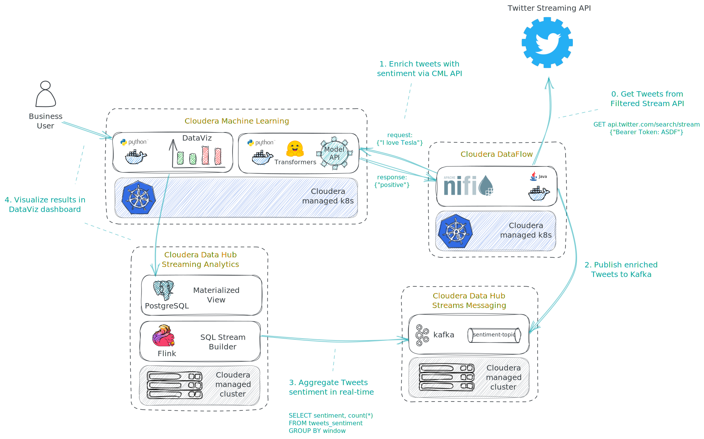

# Data Pipeline Overview

The NiFi flow retrieves tweets from the Twitter Filtered stream API, runs some preprocessing, makes a call to the Cloudera Machine Learning Model API for sentiment analysis, post-processes the results, and produces them into a Kafka topic. On the consuming side, the pipeline relies on another Data Hub cluster running Apache Flink to aggregate the data from Kafka and storing the results in a Materialized View. In the last step, a DataViz dashboard connects to the Materialized View to visualize key metrics to the end user.

## Ingestion

The pipeline leverages Apache NiFi to stream data from the Twitter API. Tweets are streamed from the (free tier) [Twitter Filtered Stream API](https://developer.twitter.com/en/docs/twitter-api/tweets/filtered-stream/introduction), which allows specifying rules to retrieve tweets for any topic. This example retrieves tweets related to the companies `Tesla`, `Apple`, `Google` and `Meta`. Here are some examples for retrieved tweets:

```json
{"data":{"edit_history_tweet_ids":["1615666407793991681"],"id":"1615666407793991681","text":"“Talented but crazy”: Potential jurors give court their opinions on Elon Musk #edwardchen #usdistrictcourt #alexspiro #tesla #elonmusk #twitter ➡️ Now on https://t.co/ICwZXPkeRb — https://t.co/WeGBXuiUDM"},"matching_rules":[{"id":"1614967083145510914","tag":"tesla"}]}

{"data":{"edit_history_tweet_ids":["1617513969870340097"],"id":"1617513969870340097","text":"@MrBigWhaleREAL Google Ai\n\nThe first ever google integrated telegram bot. Revolutionizing the telegram-google ecosystem.\nTg - @googleaierc\n\nChart - https://t.co/1xTJ0gqEPO"},"matching_rules":[{"id":"1615663077130649601","tag":"google"}]}

{"data":{"edit_history_tweet_ids":["1617513963927003136"],"id":"1617513963927003136","text":"Saving the universe should not be evaluated based on Tesla’s results vs. Wall Street estimates. That is seriously messed up."},"matching_rules":[{"id":"1614967083145510914","tag":"tesla"}]}
```

The NiFi flow retrieves data from the API using the `ConsumeTwitter` processor. This processor references the `#{TwitterBearerToken}` parameter, which is passed in the request to the Twitter API to authenticate and identify the API user. The `ConsumeTwitter` processor also provides options to limit the number of tweets retrieved, and to set a time interval for retrieval. This allows the solution to be configured to retrieve tweets from the last X minutes. Once the tweets are retrieved, they are passed on to the next steps of the NiFi flow for preprocessing and sentiment analysis. **Reminder**: It's important to note that you need to have an active Twitter developer account, and to create a bearer token to use the Twitter Filtered Stream API. The bearer token is used as a secret and should be kept secured.

## Enrichment

The pipeline relies on a [pretrained Huggingface model for sentiment analysis](https://huggingface.co/cardiffnlp/twitter-roberta-base-sentiment-latest) and the [Huggingface pipeline (Python) API](https://huggingface.co/docs/transformers/v4.25.1/en/main_classes/pipelines#transformers.pipeline). Examples for the Python API are included in the [sentiment.ipynb notebook](sentiment-analysis/sentiment.ipynb). The model is deployed using Cloudera Machine Learning to a scalable Model API (thanks to the Kubernetes backend) using the `inference.py` script. Note that the model is cached and only loaded during startup, resulting in fast response times of `< 10 ms` despite the size of the model.

The Model API is called from the NiFi ingestion flow via `InvokeHTTP` processor. `JOLTTransformJSON` processors take care of formatting JSON objects before and after the Model API is called. Example of this enrichment process ready to be published to Kafka:

```json
{
    "created_at": "2023-01-11T15:05:45.000Z",
    "id": "1613190434120949761",
    "label": "positive",
    "negative": 0.0042450143955647945,
    "neutral": 0.011172760277986526,
    "positive": 0.984582245349884,
    "text": "I love hackathons!"
}
```

The results of the sentiment analysis are produced to a Kafka topic using the `PublishKafka2RecordCDP` processor. This processor is configured to publish the sentiment analysis results to a specific topic on the Kafka cluster. The `PublishKafka2RecordCDP` processor relies on the `StandardRestrictedSSLContextService` NiFi service for encrypting data in transit between the NiFi cluster and the Kafka cluster. This ensures that the data is secure and protected while it's in transit.

## Aggregation

In the first step on the consuming side the enriched data is processed in a Flink job to produce aggregated results. The [Flink query](streaming-analytics/flink_query.sql) is developed using [Cloudera SQL Stream Builder](https://docs.cloudera.com/csa/1.3.0/ssb-overview/topics/csa-ssb-intro.html), which makes it easy to develop, deploy and monitor streaming analytics workloads written in plain SQL. The aggregation uses a fixed 1 minute time interval and additionally groups the results by company and sentiment. The results are stored in a [Materialized View](https://docs.cloudera.com/cdf-datahub/7.2.15/ssb-mv-use-case/topics/csa-ssb-using-mvs.html) for downstream consumption. The Flink job produces the following(simplified) schema:

| window_start | window_end | company | sentiment | num_tweets
| --- | --- | --- | --- | ---
| 2023-01-01 08:00 | 2023-01-01 08:01 | tesla | negative | 52
| 2023-01-01 08:00 | 2023-01-01 08:01 | tesla | positive | 41
| 2023-01-01 08:00 | 2023-01-01 08:01 | tesla | neutral | 201
| 2023-01-01 08:00 | 2023-01-01 08:01 | apple | negative | 13
| 2023-01-01 08:00 | 2023-01-01 08:01 | apple | positive | 21
| 2023-01-01 08:00 | 2023-01-01 08:01 | apple | neutral | 412
...

## Visualization

The results are visualized using Cloudera DataViz allowing to monitor social media trends in real-time. The data is consumed from the [SQL Stream Builder Materialized View](https://docs.cloudera.com/cdf-datahub/7.2.15/ssb-mv-use-case/topics/csa-ssb-mv-data-viz-connector.html): 

# Setup and deployment

The setup guide aims to include descriptions for deploying all infrastructure and application components with both CDP CLIs & APIs and the CDP UI. For the CDP CLI options, make sure to have the [CDP CLI set up and configured](https://docs.cloudera.com/cdp-public-cloud/cloud/cli/topics/mc-cli-client-setup.html) with access to a CDP Public Cloud environment.

## 0. Configure Twitter Filtered stream API

0. Register on the Twitter Developer Portal and create an [App Access Key (Bearer Token)](https://developer.twitter.com/en/docs/authentication/oauth-2-0/bearer-tokens)

1. Create persistent [rules](https://developer.twitter.com/en/docs/twitter-api/tweets/filtered-stream/integrate/build-a-rule) for your endpoint (this example uses the following rules to retrieve tweets - in English and without Re-Tweets - related to the companies `Tesla`, `Apple`, `Google` and `Meta`):

```bash
curl -X POST \
  "https://api.twitter.com/2/tweets/search/stream/rules" \
  --header "Content-Type: application/json" \
  --header "Authorization: Bearer $BEARER_TOKEN" \
  --data-raw '{
  "add": [
    {
        "value": "(tesla OR #tesla OR @tesla OR from:tesla OR to:tesla) -is:retweet lang:en",
        "tag": "tesla"
    },
    {
        "value": "(google OR $ABEA OR #google OR @google OR from:google OR to:google) -is:retweet lang:en",
        "tag": "google"
    },
    {
        "value": "(facebook OR @facebook OR #facebook OR $meta OR #meta OR @meta OR from:meta OR to:meta OR from:facebook OR to:facebook) -is:retweet lang:en",
        "tag": "meta"
    },
    {
        "value": "(@apple OR #apple OR $AAPL OR from:apple OR to:apple) -is:retweet lang:en",
        "tag": "apple"
    }
  ]
}'
```

2. Validate the rules

```bash
curl -X GET \
  "https://api.twitter.com/2/tweets/search/stream/rules" \
  --header "Content-Type: application/json" \
  --header "Authorization: Bearer $BEARER_TOKEN"
```

3. Validate streaming tweets (this should show relevant tweets)

```bash
curl -X GET \
  "https://api.twitter.com/2/tweets/search/stream?tweet.fields=text,created_at" \
  --header "Content-Type: application/json" \
  --header "Authorization: Bearer $BEARER_TOKEN"
```

## 1. Provision Cloudera Data Hubs

**CDP CLI**

Make sure to replace `CLUSTER-NAME` with your name.

- Create the Data Hub cluster for Streaming Analytics:

```bash
export CLUSTER_NAME=twitter-streaming-analytics
cdp datahub create-aws-cluster \
--cluster-name $CLUSTER_NAME \
--environment-name se-sandboxx-aws \
--cluster-template-name "7.2.16 - Streaming Analytics Light Duty with Apache Flink" \
--instance-groups nodeCount=1,instanceGroupName=manager,instanceGroupType=GATEWAY,instanceType=m5.2xlarge,rootVolumeSize=100,attachedVolumeConfiguration=\[\{volumeSize=100,volumeCount=1,volumeType=standard\}\],recoveryMode=MANUAL,volumeEncryption=\{enableEncryption=false\} nodeCount=2,instanceGroupName=master,instanceGroupType=CORE,instanceType=m5.2xlarge,rootVolumeSize=100,attachedVolumeConfiguration=\[\{volumeSize=100,volumeCount=1,volumeType=standard\}\],recoveryMode=MANUAL,volumeEncryption=\{enableEncryption=false\} nodeCount=3,instanceGroupName=worker,instanceGroupType=CORE,instanceType=m5.2xlarge,rootVolumeSize=100,attachedVolumeConfiguration=\[\{volumeSize=100,volumeCount=1,volumeType=standard\}\],recoveryMode=MANUAL,volumeEncryption=\{enableEncryption=false\} \
--image id=390e00a9-6e7d-4c5c-9be6-40f980597bd4,catalogName=cdp-default \
--no-enable-load-balancer
```

- Create the Data Hub cluster for Streams Messaging:

```bash
export CLUSTER_NAME=twitter-streams-messaging
cdp datahub create-aws-cluster \
--cluster-name $CLUSTER_NAME \
--environment-name se-sandboxx-aws \
--cluster-template-name "7.2.16 - Streams Messaging Light Duty: Apache Kafka, Schema Registry, Streams Messaging Manager, Streams Replication Manager, Cruise Control" \
--instance-groups nodeCount=1,instanceGroupName=master,instanceGroupType=GATEWAY,instanceType=r5.2xlarge,rootVolumeSize=100,attachedVolumeConfiguration=\[\{volumeSize=100,volumeCount=1,volumeType=standard\}\],recoveryMode=MANUAL,volumeEncryption=\{enableEncryption=true\} nodeCount=3,instanceGroupName=core_broker,instanceGroupType=CORE,instanceType=m5.2xlarge,rootVolumeSize=100,attachedVolumeConfiguration=\[\{volumeSize=1000,volumeCount=1,volumeType=st1\}\],recoveryMode=MANUAL,volumeEncryption=\{enableEncryption=true\} nodeCount=0,instanceGroupName=broker,instanceGroupType=CORE,instanceType=m5.2xlarge,rootVolumeSize=100,attachedVolumeConfiguration=\[\{volumeSize=1000,volumeCount=1,volumeType=st1\}\],recoveryMode=MANUAL,volumeEncryption=\{enableEncryption=true\} \
--image id=390e00a9-6e7d-4c5c-9be6-40f980597bd4,catalogName=cdp-default \
--datahub-database NON_HA \
--no-enable-load-balancer 
```

**CDP UI**

From your CDP environment navigate to Data Hubs and deploy the templates:

- 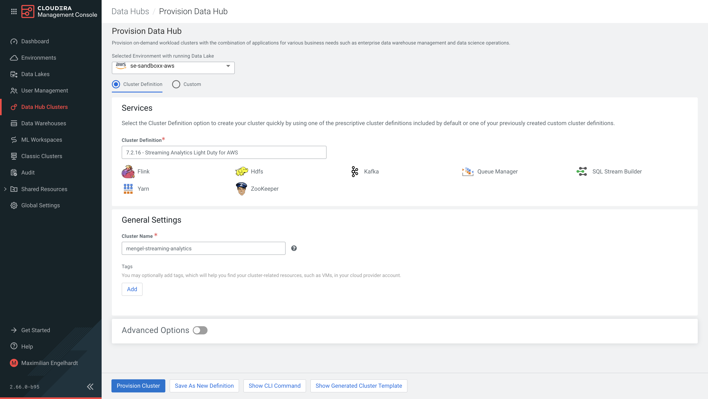
- 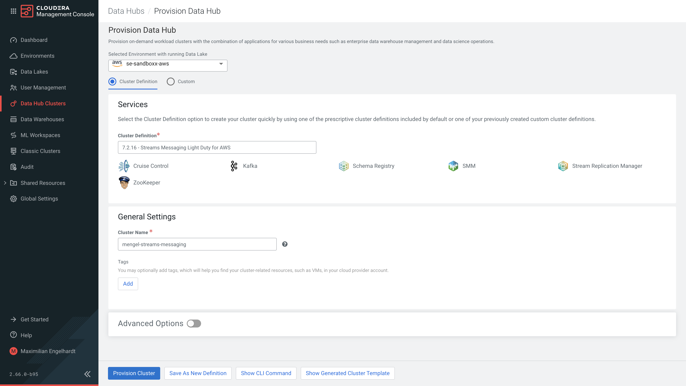

## 2. Deploy the Model API as a Cloudera Machine Learning AMP

This guide assumes access to an active CML Workspace. The Model API in this solution is wrapped in a CML AMP to automate the bootstrapping process from CML Project to Model API. The AMP specification is done in the [.project-metadata.yaml](sentiment-analysis/.project-metadata.yaml) file.

**CDP UI**

0. Create a new Project from the UI and select `AMP` and specify `https://github.com/maxhardt/twitter-sentiment-amp`: 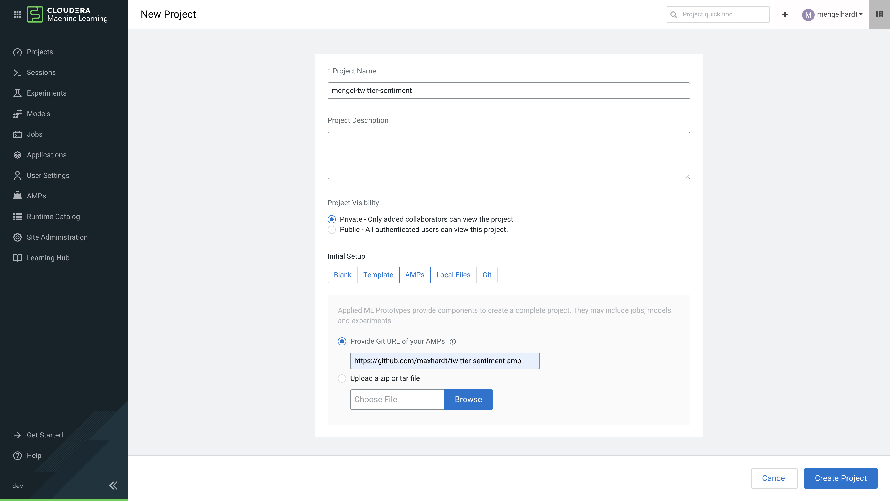
1. In the next step, click Launch Project and leave the Runtime specification as is: 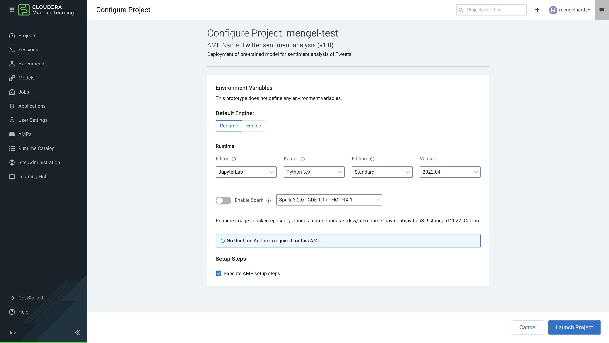
2. The AMP then deploys the Model API automatically (Note: This step takes around ~10 mminutes): 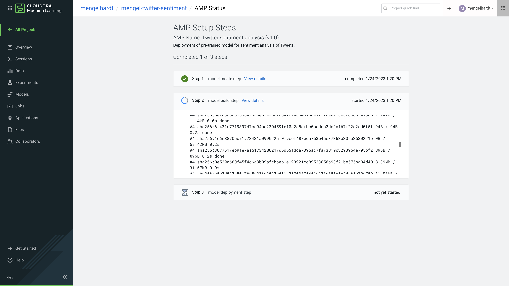
3. Once the deployment completes, navigate to the Model and take note of the endpoint including access key: 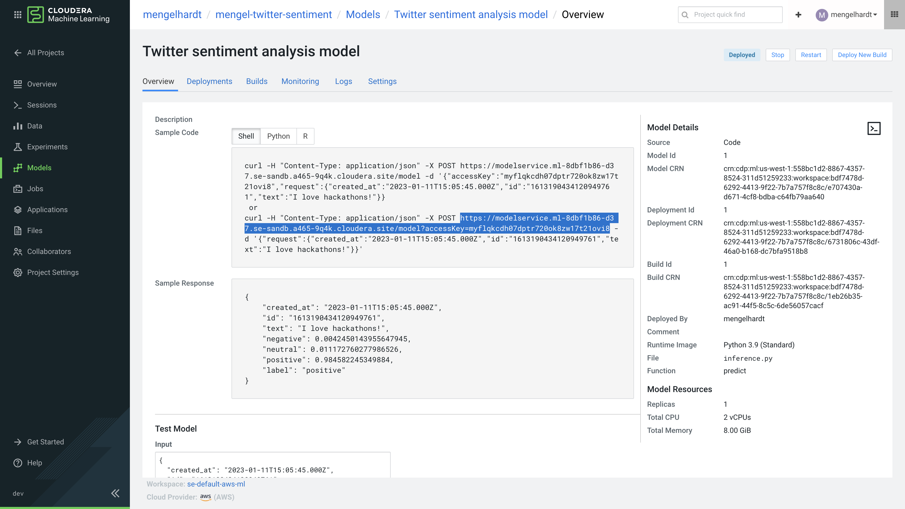

- Example endpoint URL: https://modelservice.ml-8dbf1b86-d37.se-sandb.a465-9q4k.cloudera.site/model
- Example access key: myflqkcdh07dptr720ok8zw17t21ovi8

## 3. Deploy the NiFi Flow using Cloudera DataFlow

This guide assumes access to an active CDF environment.

**CDP CLI**

1. Register the NiFi flow specified in [twitter-sentiment-flow.json](nifi-twitter-flow/twitter-sentiment-flow.json) in the Cloudera DataFlow Catalog:

```bash
cdp df import-flow-definition \
  --name "twitter-sentiment" \
  --file "nifi-twitter-flow/twitter-sentiment-flow.json"
```

1. Create a file `nifi-twitter-flow/twitter-sentiment-parameter-groups.json` from the template [twitter-sentiment-parameter-groups.template.json](nifi-twitter-flow/twitter-sentiment-parameter-groups.template.json) and fill in values for all fields with details from the previous steps. For listing the Kafka broker hostnames via CDP CLI use `cdp datahub describe-cluster --cluster-name <CLUSTER_NAME>`. Full list of parameters with examples:

        CMLModelEndpoint: The CML Model endoint (without the access key). Example: https://modelservice.ml-8dbf1b86-d37.se-sandb.a465-9q4k.cloudera.site/model
        CMLModelEndpointAccessKey: The access key for the CML Model endpoint. Example: myflqkcdh07dptr720ok8zw17t21ovi8
        KafkaBrokers: The hotsnames of the Kafka Brokers in your Streams Messaging Data Hub suffixed with Port 9093. Example: mengel-streams-messaging-corebroker2.se-sandb.a465-9q4k.cloudera.site:9093,mengel-streams-messaging-corebroker1.se-sandb.a465-9q4k.cloudera.site:9093,mengel-streams-messaging-corebroker0.se-sandb.a465-9q4k.cloudera.site:9093
        TwitterAPIBearerToken: Your Twitter BearerToken.
        WorkloadPassword: Your CDP workload password.
        WorkloadUser: Your CDP username.

2. Set service and flow version CRN.

```bash
export SERVICE_CRN=crn:cdp:df:us-west-1:558bc1d2-8867-4357-8524-311d51259233:service:fe862efb-58dd-40eb-84ea-51c2838da6d4
export FLOW_VERSION_CRN=crn:cdp:df:us-west-1:558bc1d2-8867-4357-8524-311d51259233:flow:twitter-sentiment/v.1
```

3. Deploy the imported Flow on your CDF environment:

```bash
cdp df create-deployment \
  --service-crn $SERVICE_CRN \
  --flow-version-crn $FLOW_VERSION_CRN \
  --deployment-name "twitter-sentiment" \
  --cfm-nifi-version 1.18.0.2.3.7.1-1 \
  --no-auto-start-flow \
  --cluster-size-name SMALL \
  --static-node-count 1 \
  --no-auto-scaling-enabled \
  --parameter-groups "$(cat nifi-twitter-flow/twitter-sentiment-parameter-groups.json)"
```

**CDP UI**

1. Register the NiFi flow specified in [twitter-sentiment-flow.json](nifi-twitter-flow/twitter-sentiment-flow.json) in the Cloudera DataFlow Catalog: 

2. Start the deployment of the imported Flow on your CDF environment: 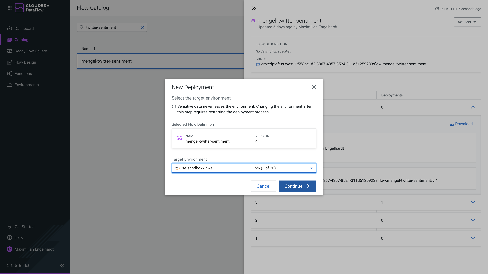
3. Make sure to uncheck the "Autostart Behavior" box to avoid errors: 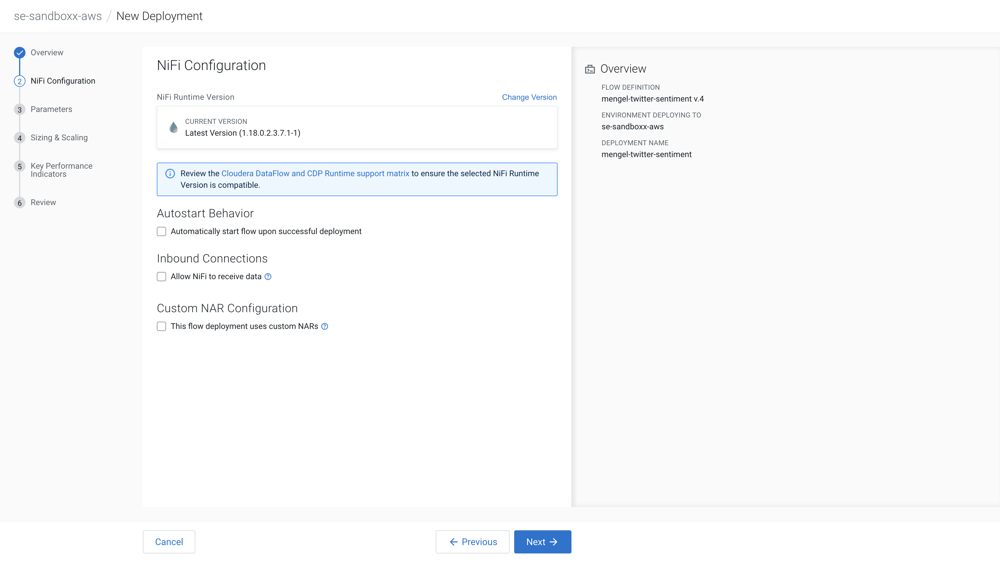
4. In the next step, fill in the parameters as described below: 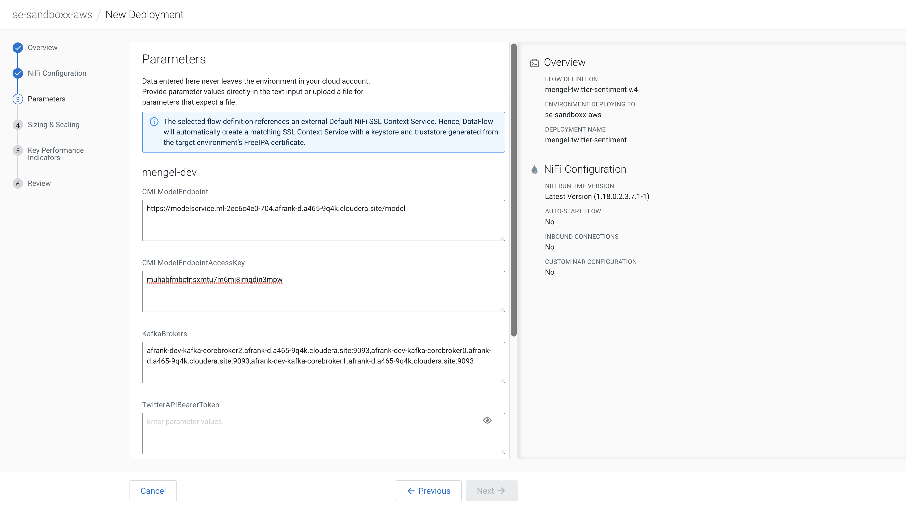

    - CMLModelEndpoint: The CML Model endoint without access key.
      - Example: https://modelservice.ml-8dbf1b86-d37.se-sandb.a465-9q4k.cloudera.site/model
    - CMLModelEndpointAccessKey: The access key for the CML Model endpoint.
      - Example: myflqkcdh07dptr720ok8zw17t21ovi8
    - KafkaBrokers: Navigate to your [Streams Messaging Data Hub](#1-provision-cloudera-data-hubs) and take note of the Kafka Brokers `FQDNs` along with Port `9093`: 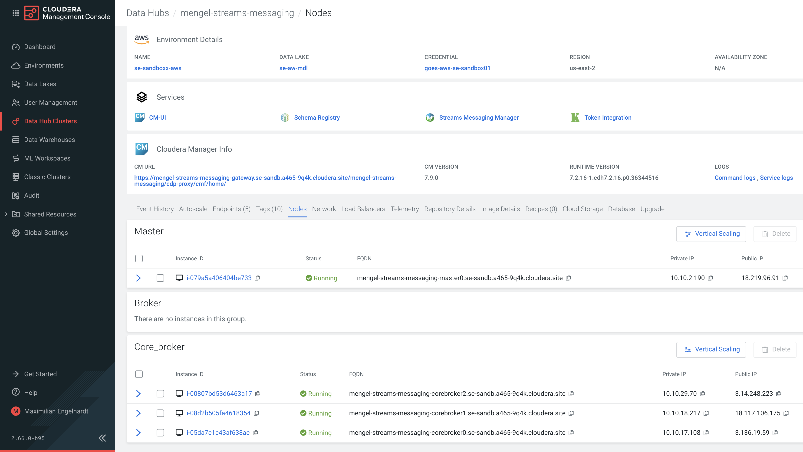 
      - Example: mengel-streams-messaging-corebroker2.se-sandb.a465-9q4k.cloudera.site:9093,mengel-streams-messaging-corebroker1.se-sandb.a465-9q4k.cloudera.site:9093,mengel-streams-messaging-corebroker0.se-sandb.a465-9q4k.cloudera.site:9093
    - TwitterAPIBearerToken: Your [Twitter BearerToken](#0-configure-twitter-filtered-stream-api).
    - WorkloadPassword: CDP workload password.
    - WorkloadUser: CDP username.

5. For sizing and Scaling select the `Small` option: 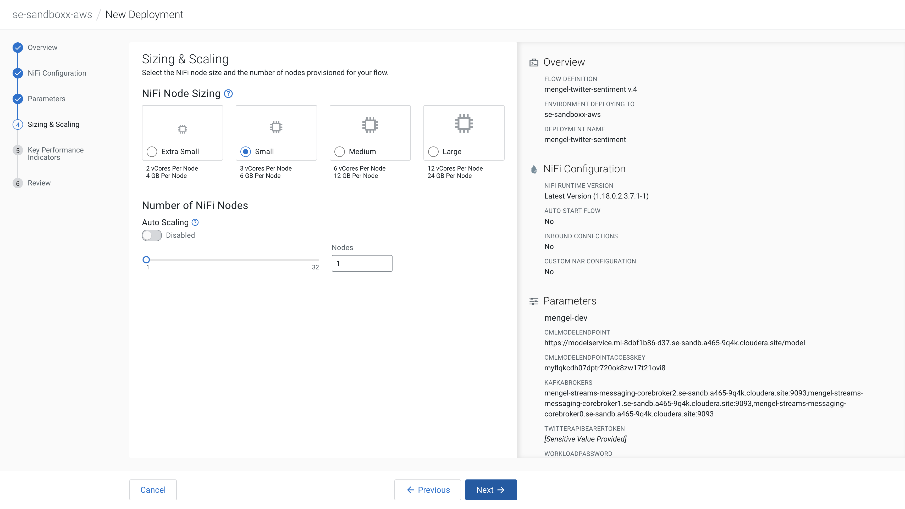
6. Leave everything else as is and click `Deploy`. The deployment takes around ~10 minutes : 

## 4. Start the NiFi Flow and validate messages arrive in Kafka

**CDP UI**

- In CDF navigate to "Manage Deployment" and click on "View in NiFi" to open the NiFi UI: 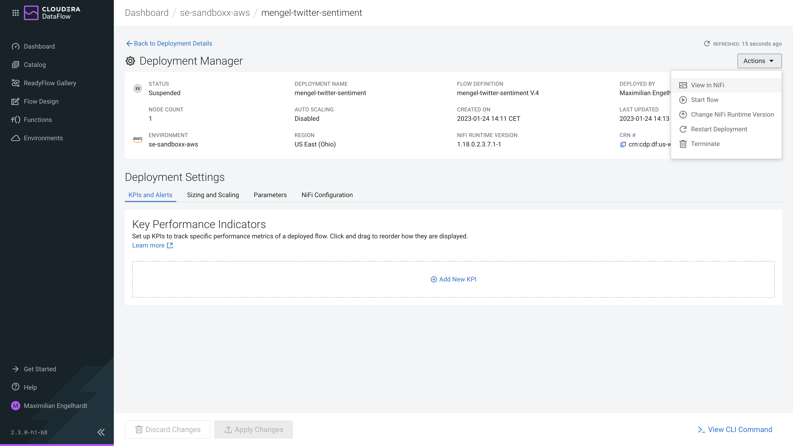
- Start all NiFi Controller Services and Processors and validate there are no errors: 
- Navigate to the Streams Messaging Data Hub and click the "Streams Messaging Manager" icon. Validate there are messages in the `twitter-sentiment` topic: 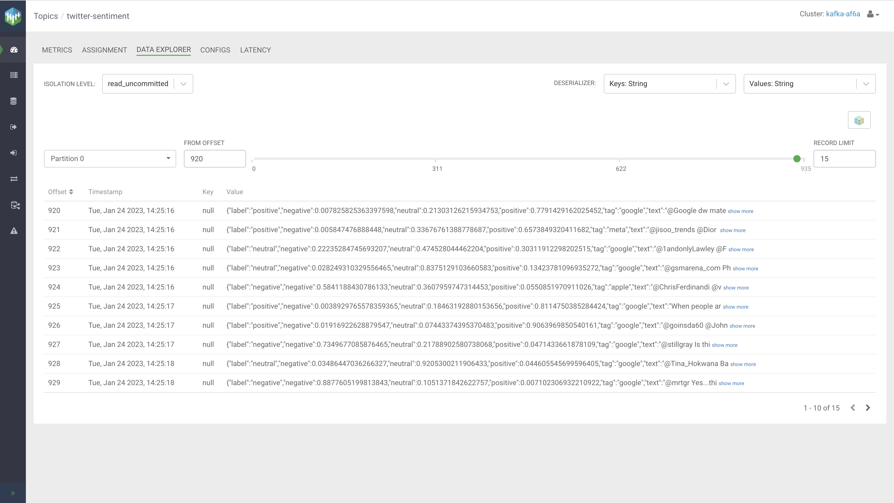

## 5. Build the aggregated Materialized View in SQL Stream Builder (SSB)

This step requires you to have downloaded the Kerberos Keytab for your CDP user. To download your Keytab navigate to CDP Management Console and specify the environment you need the Keytab for: 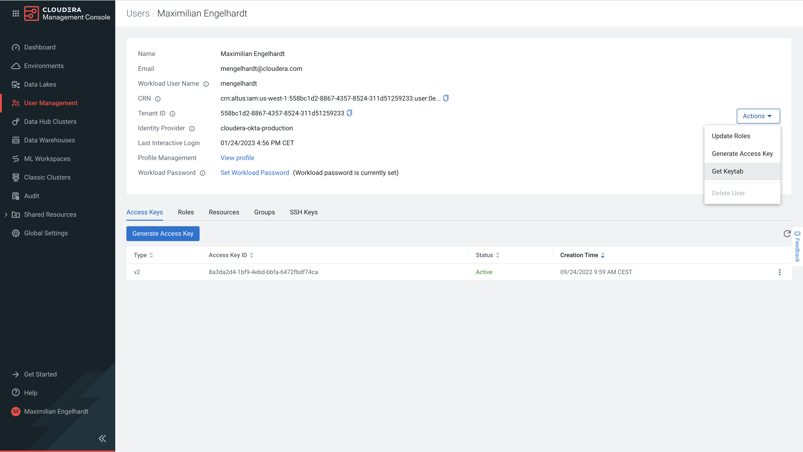

**CDP UI**

1. Navigate to the [Streaming Analytics Data Hub](#1-provision-cloudera-data-hubs) and click on the "Streaming SQL Console" icon
2. In the SSB UI navigate to Upload Keytab and upload your Keytab. Use your CDP username for the principal name: 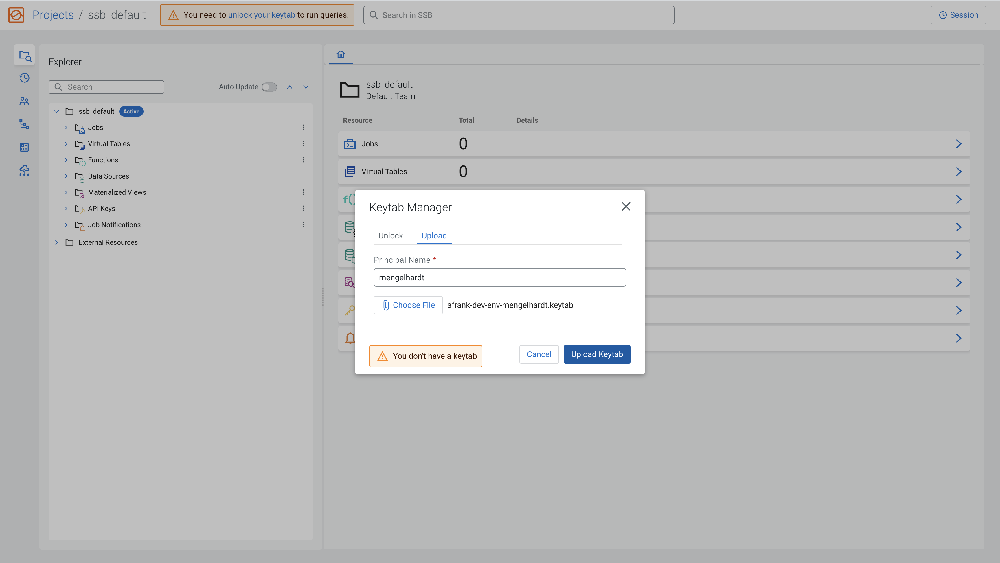
3. Navigate to the `ssb_default` project and create a `Kafka Data Source`: 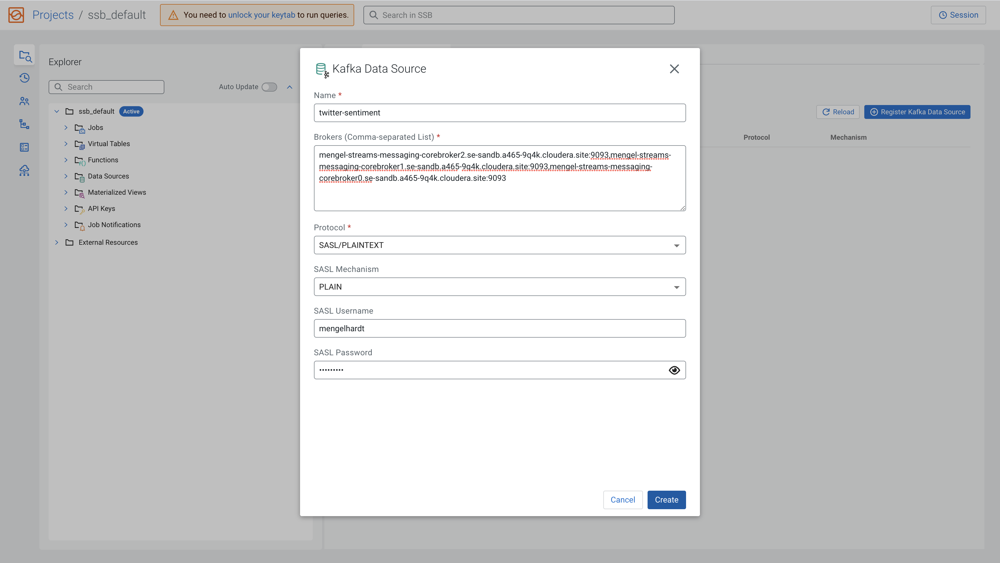

   - Protocol: SASL/SSL
   - SASL Mechanism: PLAIN
   - SASL Username: CDP username.
   - SASL Password: CDP Workload password.
   - Everything else: Leave to default values.
   - Note #1: Make sure the CDP environment users are synced to make sure the connection between the Data Hub clusters with CDP user credentials can work.
   - Note #2: Make sure the NiFi flow is running before the next step in order to detect the Schema automatically.

4. Create a `Virtual Table` based on the `Kafka DataSource` and use the functionality to detect the Schema automatically: 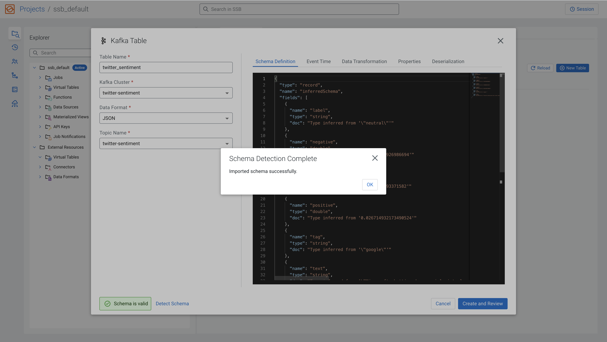
5. Create a `Flink Job` by using the query specified in [flink_query.sql](/streaming-analytics/flink_query.sql): 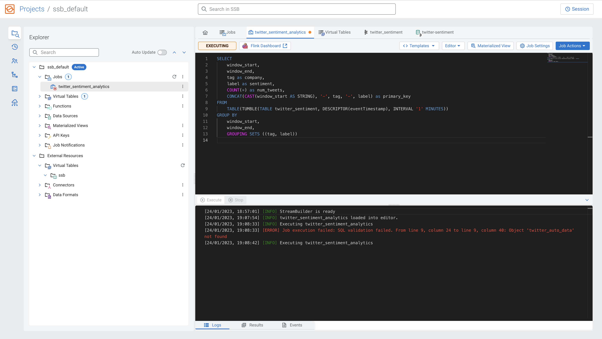
6. Validate the `Flink Job` is creating the expected schema and results: 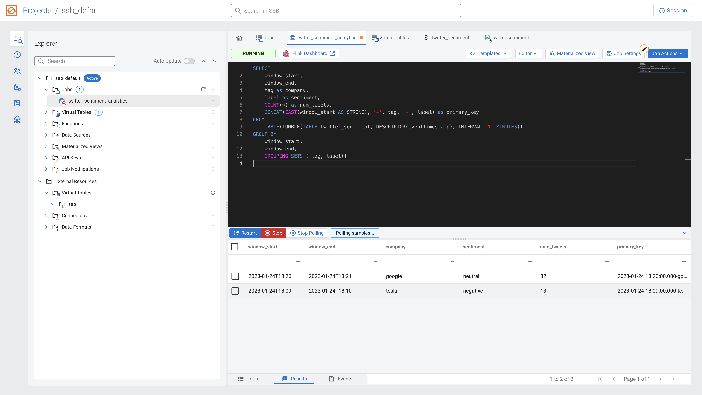
7. Create the `Materialized View` based on the `Flink Job` using "Select All" 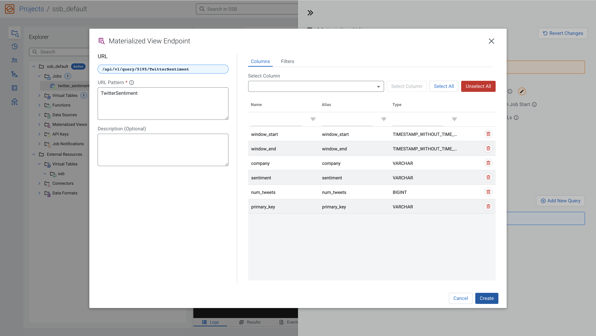

## 6. DataViz

In the last step Cloudera DataViz is deployed on CML and connected to the SQL Stream Builder Materialized View from the previous step. The dashboard along with `Data Connections` and `Datasets` are automatically imported from the dashboard files. Alternatively feel free to create your own dashboard instead. 

**CDP UI**

1. From your project in the CML UI navigate to the Data tab and Start the DataViz application: 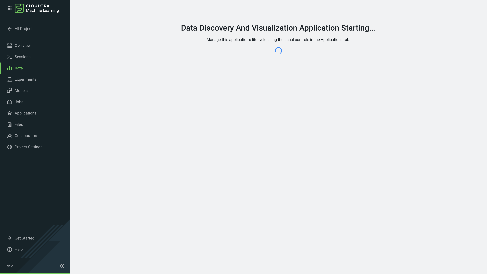
2. In the DataViz UI create a new `Data Connection` to the Materialized View PostgreSQL backend: 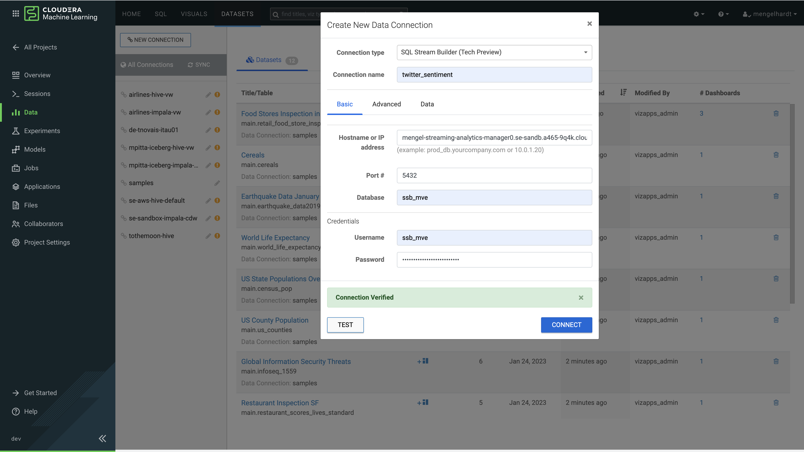

    - Connection type: ...
    - Connection name: <CONNECTION NAME>
    - Hostname: ...
    - Port: 5432
    - Username: ssb_mve
    - Password: ...

3. Import the dashboard by clicking on "Import Visual Artifacts" and uncheck the box for "Check Compatibility" 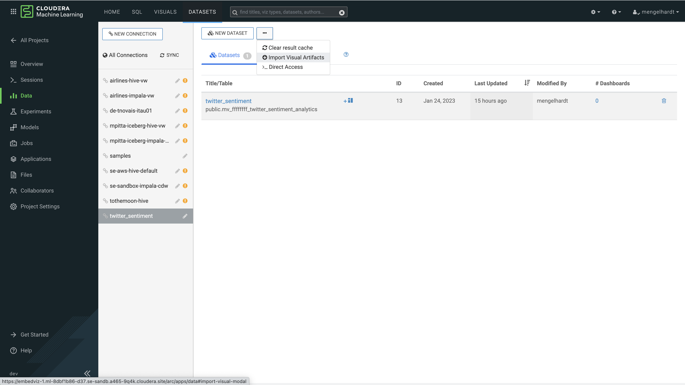
4. Verify the dashboard is displaying the expected results: 
